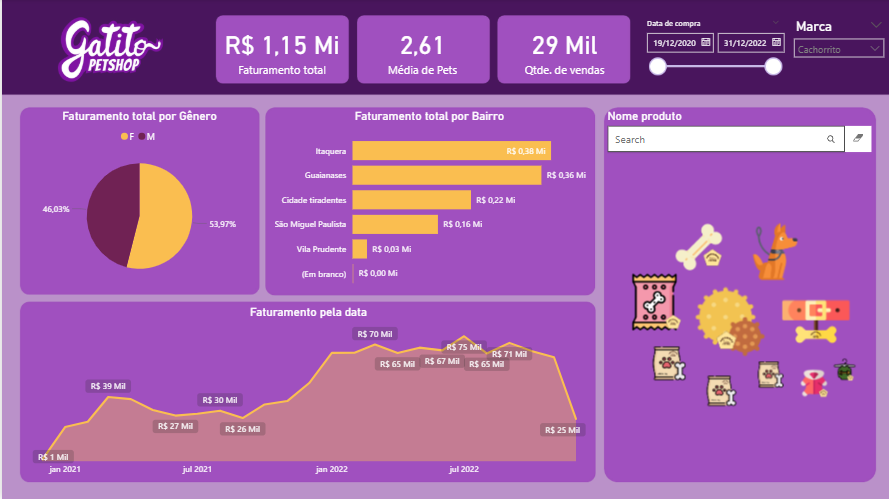

# PowerBI - Dashboard Petshop

Projeto desenvolvido em Power BI com foco na análise de vendas e operações de um petshop,
construindo dashboards interativos para insights sobre produtos, clientes e desempenho financeiro.

## Dashboard Final - PetShop - Gatitos

## Objetivos
Analisar o desempenho de vendas de produtos para pets (ex.: rações, brinquedos e acessórios),
por categoria e período, utilizando indicadores e visualizações claras para otimizar decisões.

## Principais Análises
- Receita total por categoria de produto
- Vendas por cliente e região
- Evolução das vendas ao longo do tempo

## Tecnologias Utilizadas
- Power BI  
- DAX (Data Analysis Expressions)  
- Power Query (ETL)  
- Modelagem de Dados  
- Relacionamentos entre Tabelas
- Power BI Service
  

## Habilidades Demonstradas
Este projeto reflete expertise em construção e publicação de dashboards no Power BI, aplicada para processar dados de petshop e gerar insights acionáveis. Aqui estão as principais habilidades utilizadas:

- **Conectando os dados**: Integração eficiente de fontes de dados variadas (como planilhas de vendas ou bancos de inventário) em modelos visuais, assegurando que informações sobre produtos e clientes estejam prontas para análises dinâmicas.
- **Realizando cálculos**: Aplicação de fórmulas e medidas (como DAX) para criar indicadores personalizados, como receita total por categoria ou margem de lucro em vendas de rações.
- **Análises com os gráficos**: Desenvolvimento de visualizações interativas, incluindo gráficos de pizza para distribuição de vendas por produto, linhas para tendências sazonais e mapas para vendas por região.
- **Estilização do relatório**: Design profissional de dashboards, com layouts intuitivos, paletas de cores temáticas (ex.: tons de verde e azul para um petshop) e elementos visuais que facilitam a navegação e interpretação de dados.
- **Power BI Service**: Publicação e compartilhamento de relatórios na nuvem, permitindo atualizações automáticas, acesso remoto para gestores e colaboração em tempo real para decisões rápidas sobre estoques ou promoções.

Essas habilidades garantem que o projeto seja intuitivo, escalável e focado em insights práticos para operações de petshop, desde a conexão de dados até a entrega de dashboards prontos para uso.

**Principais análises visuais:**
- Média dos Pets
- Quantidade de Vendas
- Faturamento Total
- Faturamento por Gênero
- Faturamento por Bairro
- Evolução da margem de lucro ao longo dos anos
- Produtos Vendidos

## Observações
Dados fictícios ou educacionais, utilizados para fins de estudo e portfólio. Projeto desenvolvido com base em curso da plataforma **Alura**, com organização
e documentação próprias.

---
